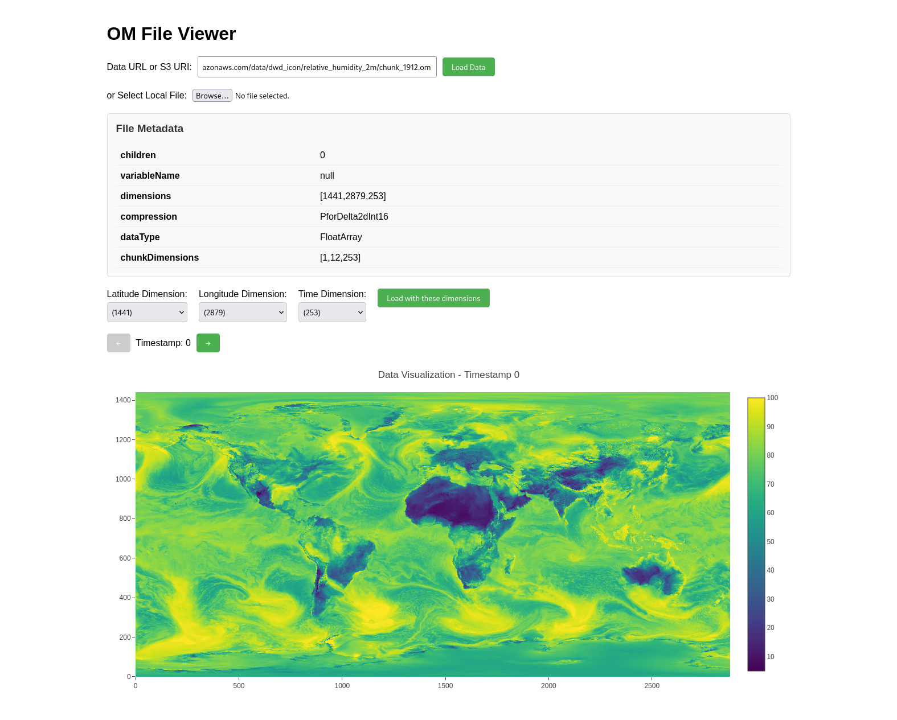

# Browser Based Open-Meteo File Format Viewer

This is a small POC web-app, demonstrating how to use the Open-Meteo File Format in the browser using JavaScript and WebAssembly via [open-meteo/typescript-omfiles](https://github.com/open-meteo/typescript-omfiles).

It is deployed on [GitHub Pages](https://terraputix.github.io/omfiles-web-demo/).

The app supports loading datasets from S3 and local files. For files on S3 currently the complete dataset is loaded into memory, because the partitioning of the provided datasets on S3 is temporal and not spatial. If the datasets are partitioned spatially, the app could load only the relevant partitions to display single time steps.



## Development

```bash
npm install
npm run build
npm run preview
```

## Contributing

Feedback and contributions are welcome! Please open an issue or a pull request.
